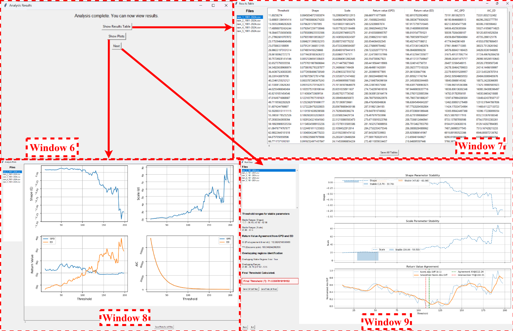

# Supplementary Interface Material (S1)

This directory contains the detailed EVT-AutoThresh interface views relocated from the main manuscript to Supplementary Material S1.

## Supplementary Interface Figure S1
**EVT-AutoThresh GUI Stage A: data input and preprocessing.** The panels show input-file selection, missing-value handling, optional outlier review, export of cleaned data, and the cleaned-data overview before threshold analysis.

## Supplementary Interface Figure S2
**EVT-AutoThresh GUI Stages B-C: post-analysis diagnostics and threshold evaluation.** The panels show the post-analysis hub, threshold-wise results table, diagnostic plots, and the final decision window used to inspect parameter-stability and GPD-ED return-level diagnostics.

The figures are provided as supplementary implementation/interface documentation for the manuscript *A Reproducible Diagnostic Framework for EVT-Consistent Automatic Threshold Selection in Peaks-over-Threshold Analysis*.
